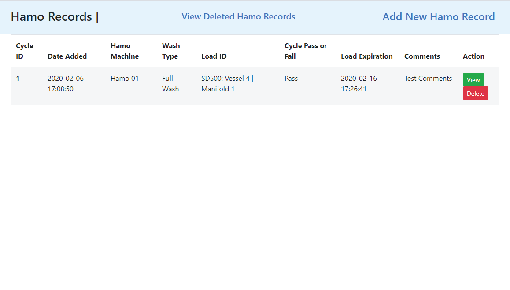

# hamo_records_app
Hamo washing machine record and audit trail app


## What is Hamo Records app?
The Hamo Records app is a tool that generates a complete backend MySql database where you can create, read, update and delete records in the hamo records database.

It has been programmed using python flask framework

## Installation
### Clone the repository
Navigate to the directory folder you wish to clone the hamo_records_app and enter the following command:
```
$ git clone https://github.com/Titch-dev/hamo_records_app.git

$ cd hamo_records_app
```
The hamo_records_app folder already comes with the virtual environment ready populated with required packages to run the application. (requirements.txt is included listing all packages needed)

## Generate the CRUD backend
### Download MySQL
Download the MySQL Installer:
https://dev.mysql.com/downloads/installer/

Follow the installation instructions, setting your admin and admin password

### Creating the Database
Open hamo_records_db.sql in your prefered IDE or text editor. Copy all syntax and paste into mysql shell:
```
# example of entries into mysql shell

mysql> CREATE DATABASE hamo_records_db;

mysql> USE hamo_records_db;

mysql> CREATE TABLE IF NOT EXISTS hamo_wash_cycle(
  id INTEGER NOT NULL AUTO_INCREMENT,
  date_added TIMESTAMP NOT NULL default CURRENT_TIMESTAMP,
  hamo_machine_id VARCHAR(12) NOT NULL default "",
  calibration_expiry_date DATE default NULL,
  daily_test_confirmation ENUM('Yes', 'No') default NULL,
  wash_type ENUM('Full Wash', 'Rinse Wash') default NULL,
  load_type VARCHAR(255) NOT NULL default "",
  full_wash_chemical_list VARCHAR(255) default "N/A",
  rinse_wash_tubing_list VARCHAR(255) default "N/A",
  pre_wash_passed ENUM('Yes', 'No', 'N/A') default 'N/A',
  caustic_wash_passed ENUM('Yes', 'No', 'N/A') default 'N/A',
  acid_wash_passed ENUM('Yes', 'No', 'N/A') default 'N/A',
  final_rinse_passed ENUM('Yes', 'No') default NULL,
  drying_stage_passed ENUM('Yes', 'No') default NULL,
  comments VARCHAR(500) NOT NULL default "N/A",
  cycle_result ENUM('Pass', 'Fail', 'Pending') NOT NULL default 'Pending',
  wash_expiration_date TIMESTAMP NOT NULL default CURRENT_TIMESTAMP,
  hamo_stage_one_status_id INTEGER(11) default NULL,
  hamo_stage_two_status_id INTEGER(11) default NULL,
  hamo_stage_three_status_id INTEGER(11) default NULL,
  is_hidden INTEGER(11) default 0,
  PRIMARY KEY (`id`)
) ENGINE = InnoDB DEFAULT CHARSET = utf8;

 ```
 The database is now created.
 
 
### Creating Database User
You will need to create a MySQL user and grant all privileges. In the mysql shell create a new user:
```
# choose a secure password in place of 'testpassword'

mysql> CREATE USER 'hamo_records_db'@'localhost' IDENTIFIED BY 'testpassword';

mysql> GRANT ALL PRIVILEGES ON hamo_records_db . * TO 'hamo_records_db'@'localhost';
```
Open hamoapp.py in chosen IDE/text editor and ammend the database config password `'testpassword'` to your chosen secure password:
```
# hamoapp.py line 10 
app.config['MYSQL_PASSWORD'] = 'testpassword'
```
Save the changes.

## Launching the application
### Launching in local environment
In the terminal navigate to /hamo_records directory:
```
$ cd hamo_records
```
Activate the virtual environment:
```
$ source env/Scripts/activate
```
Run the hamoapp.py file using the following command:
```
$ python hamoapp.py
```
Now open your prefered web browser and navigate to http://127.0.0.1:5000/

## Basic Usage
### Landing/Index page

Here the user is able to:
  * View An abridged version of all hamo records created in descending order
  * Click *View Deleted Hamo Records* to be redirected to Deleted page
  * Click *Add New Hamo Record* (nav bar)
  * Click *View* on a row to see all information of hamo record
  * Click *Delete* on a row to move chosen record to deleted page

### Adding a Hamo record
Click *Add New Hamo Record* link located in the index nav bar
  * Fill out the required fields in stage one and submit
  
  * Fill out the required fields in stage two and submit
  
  * Fill out the required fields in stage three and submit
  
Once the stage three data has been submitted the user will be redirected back to the landing/index page where the most recent hamo record will be displayed.

### View completed Hamo Record


### View Deleted page


### License
Click this link to view the [LICENSE](LICENSE.md)